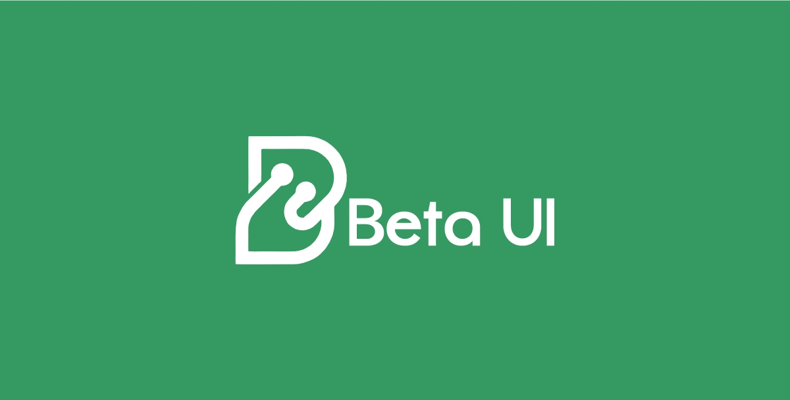

# Beta UI

<div align="center">
  
  
  A modern UI component library built with React and Next.js
</div>

## Overview

Beta UI is a sleek, modern UI component library designed to help developers build beautiful web applications quickly and efficiently. Visit our [live demo](https://betaui.vercel.app/) to see the components in action.

## Features

- 🎨 Modern, minimalist design
- 🌗 Dark mode support
- 📱 Fully responsive components
- ⚡️ Built with React & Next.js
- 🎯 TypeScript support
- 🔧 Easy to customize

## Getting Started

### Installation

```jsx
npm install @brightcodeui/beta-ui
# or
yarn add @brightcodeui/beta-ui
```


### Usage

```jsx
import { Button } from '@brightcodeui/beta-ui';

function App() {
  return (
    <div>
      <Button variant="red">Click Me</Button>
    </div>
  );
}

export default App;
```


## 📖 Documentation

For detailed usage and component examples, visit the [Beta UI Website](https://betaui.vercel.app/).